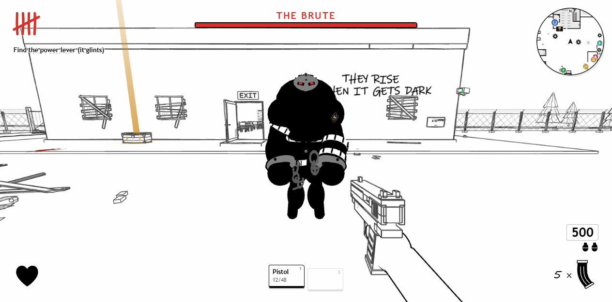
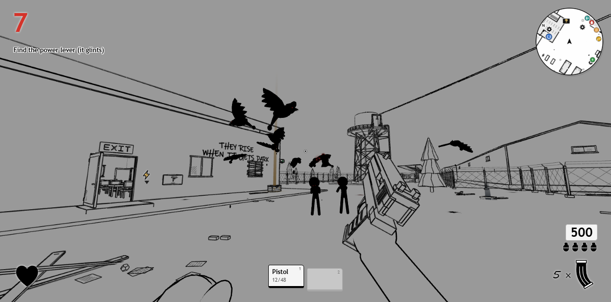

# Dead Ink

A Call of Duty Zombies-style survival game that runs in the browser, drawn in ink on paper: colour appears only where it means something. Up to four players in co-op, no download. Also includes **Operation Safe Return**, a stealth hostage-rescue mission, playable solo or in co-op.




**Play it now:** https://fundedkaizen.github.io/dead-ink/?mode=zombies (the hostage mission: https://fundedkaizen.github.io/dead-ink/)

## What's in it

- Endless rounds of zombies with Call of Duty's health curve, points and prices
- Wall guns, the Mystery Box (with rarity colours), Pack-a-Punch, perks, power-ups, boarded windows
- Wonder weapons: the Ink Ray, the Ink Rocket, the Ink Doll
- **The Brute**: a boss that hunts you across rounds, with a telegraphed charge, a jumpable ink-wave slam, thrown debris, an iron mask that breaks off, and an enrage
- **Ink Storms**: rounds of flying Inkwings that circle, shriek and dive at you
- A buildable power switch and parts, a radar mini map, an Easter egg quest
- Co-op for 2 to 4 players: lobby, last stand with a pistol, syringe revives, a Call of Duty-style game over
- All sound effects are synthesised in code (Web Audio)

## Run it

```sh
npm install
npm run dev
```

Open the local Vite URL. Dead Ink is at `/?mode=zombies`; the hostage mission is at `/`. Co-op works through the dev server's built-in relay: host from the Co-op page and send your friends the invite link (for friends outside your network, serve a build with `npm run build` and `npx vite preview` behind a tunnel). Automatic live reload is disabled so edits do not reset a running game; refresh to load changes.

Built with TypeScript, Three.js, Preact and Vite.

Based on [operation-ink](https://github.com/byteab/operation-ink) by Ehsan Sarshar, whose MIT-licensed stickman engine and hostage mission this grew from.

- `npm run build` — type-check and build for production.
- `npm test` — run all logic checks (on Windows, run the `scripts/*-checks.ts` files through `node scripts/check-player.mjs` from Git Bash).

[MIT](LICENSE) covers the source code. Audio has separate terms; Project I.G.I. recordings are not licensed for reuse here. See [sound credits](public/sounds/CREDITS.md).

## Working with coding agents

[AGENTS.md](AGENTS.md) contains the shared project instructions, structure, and testing guide. The [browser-check workflow](.agent/skills/browser-check/SKILL.md) covers visual verification of the game and character lab.

`.agent/` holds repository workflow notes; automatic discovery depends on the coding tool. `CLAUDE.md` imports the shared instructions for compatibility. Keep machine-local settings out of Git and save generated screenshots, recordings, and test evidence in the ignored `artifacts/` directory.

## Gameplay

https://github.com/user-attachments/assets/d397e167-213b-419d-9b45-5d0fcb534e4e


https://github.com/user-attachments/assets/72868325-db6f-4837-80ec-334a9c56af82


